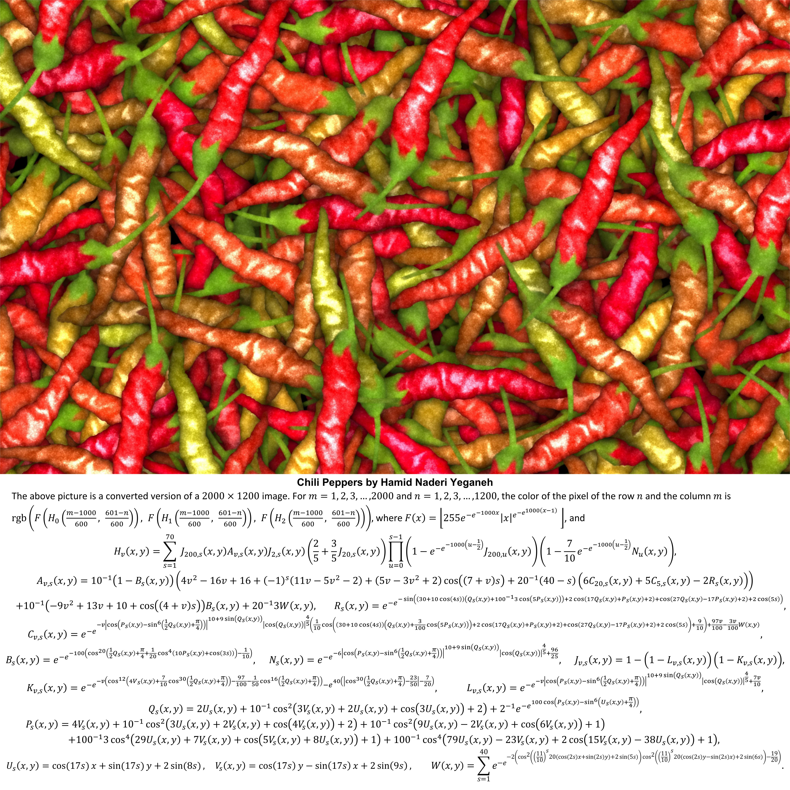

# Generating Chili Peppers

I came across [this tweet](https://x.com/naderi_yeganeh/status/1807705246916890844) which claimed to be able to generate this image of chili peppers using these formulas:

I was immediately intrigued, and decided to verify this. 

At first, I implemented these formulas in numpy, and implemented the sum and product functions in the H and W functions using for-loops, and then tried to generate the image by using a double for-loop over all possible m and n values to generate each rgb value one at a time.

This turned out to be far too inefficient, and would've taken hundreds of days to generate!

So, I started optimizing my code over and over again until I got the generation time down to a little over 3 minutes! Here are the optimizations I made:

- vectorized the sum and product functions in the H function (and implemented the product in a way such that the inner expression only needed to be computed s times instead of s2 times)
- vectorized the sum function in the W function
- vectorized the entire image so I wasn't looping over individual pixels, but then split this into chunks so that memory usage didn't explode
- refactor the functions to avoid repeated calls (implementing these formulas exactly as described causes a lot of redundant and expensive calls)
- used multi-threading to parallelize some operations

And then, lo and behold, I was able to generate this image in a little over 3 minutes:

I'm sure there are many more optimizations to be made, but I have reached the end of the time box that I allocated towards this, so leaving this as is.